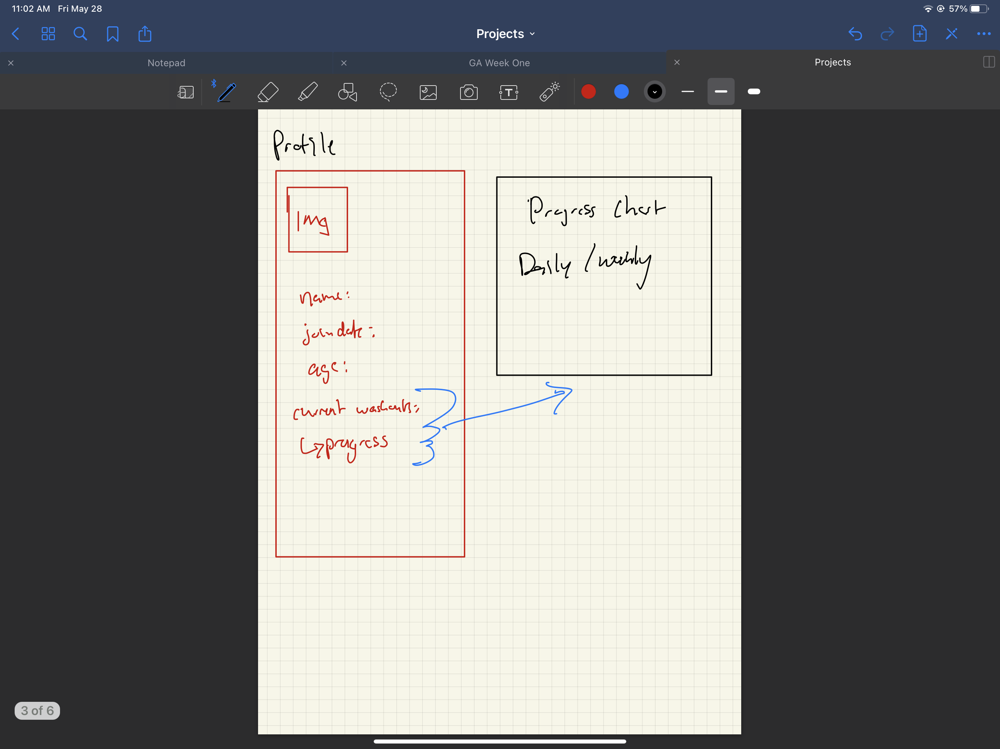

# GA-Capstone-
#GA Capstone: NOW!
***

# Technologies Used
***
* Django
* Python
* HTML
* Javascript
* CSS 
* postgreSQL 

#User Stories 

***Summary***
    NOW! is a prototype fitness app where users can log their sets and reps for each exercise in their workout. It currently includes a total of three premade workouts for Boxing, Yoga, and Bodyweight fitness. These workouts range from 3-5 minutes and upon completion, users are encouraged to repeat the workout a total of five times to get an adequate workout for the day. 

    The exercises do not require any equipment and users will be able to easily follow along with the exercises from the comforts of their home, as well as make entries into their personal log to track progress over time. 

***User Flow***
    1. While anyone can participate in the provided workouts, in order to keep track of their progress in these workouts a User must first register an account by providing a username and password.
    
    2. Upon signup, the User will be redirected to the entry log page. 

    3. To get started with the app, the user should naviagte to the workouts dropdown menu in the navbar, and select one of the available workouts. 

    4. Once selected, User will be directred to a workout, and can begin by clicking the button. 

    5. Once button is clicked, workout will run for a set amount of time, prompting user to perform certain excercises during set intervals.

    6. Once workout is complete, timer will notify User that the workout is over.

    7. Once workout is over, User can either repeat the workout for additional fitness or navigate back to the entry log to log their performance for each exercise in the workout.

    8. Once entries are logged, User can view entries in the Fitness Tracker navbar item. 

    9. User can use Fitness Tracker to query by date or exercise name and juxtapose performance. 

***WIREFRAMES***

***User Story***

